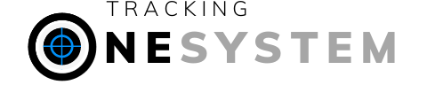

Welding tracking system software with adaptable, dynamic, easy, fast and multi-platform support for welded manufacturing companies.

For a more detailed introduction, please visit our website.

Website: [onesytem.app](https://onesytem.app)

#### Dependencies
- Flutter/Dart
- Kotlin
- Swift
- Javascript
- Python/Django
- MySQL

          

## Getting Started

### Login Page
- Mysql was used as database.
- If the user checks the remember me option when logging in, the information will be saved in the local database. It will be transferred directly to the main screen at the next login.
- And more...

### Main Page
- Querying and viewing isometric information.
- View isometry drawing as pdf file.
- View and download reports for the spool or weld joints.
- And more...

### PDFViewer
- Pdf viewing screen to view isometric drawing files.
- Zoom , scroll , bookmark feature etc.

## Get The Demo Application
      

## Support And Feedback
For support and feedback, you can contact us via email. Thank you.
> Email: [oguz-kaba@hotmail.com](mailto:oguz-kaba@hotmail.com)

## License
[MIT](./LICENSE)
Coded by [oguzkaba](https://github.com/oguzkaba)
